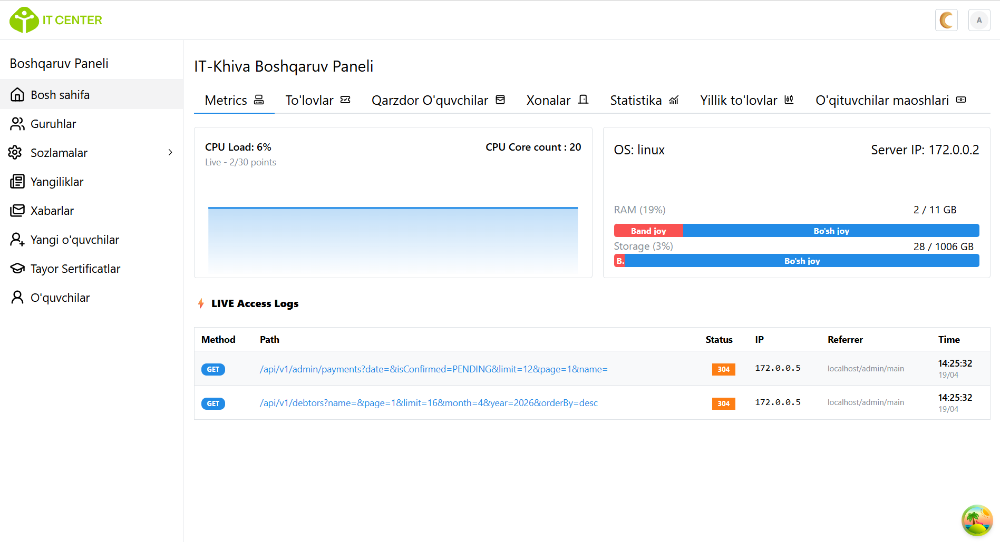
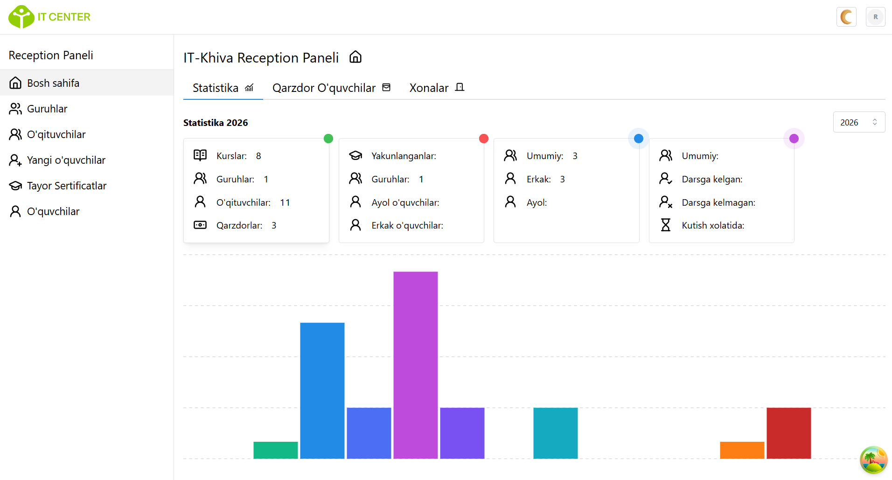

# [IT-Khiva](https://it-khiva.uz)


A modern web application for managing student activities at the IT Center platform. This system helps track student payments and automate certificate issuance after graduation, with a clean and responsive interface for students, administrators, and reception staff.

---

## 📌 Overview

IT-Khiva is designed to simplify administrative workflows in IT education centers. It provides tools to:

- Manage and maintain student records  
- Track and control student payments  
- Generate receipts for each payment  
- Issue certificates upon course completion  
- Provide a smooth and responsive user experience across all devices  

The project follows a modular architecture with separate frontend and backend services.

---

## 📸 Screenshots

### Admin Panel


### Reception Panel


---

## 🚀 Features

- 📱 Responsive design (mobile & desktop)
- 🎨 Clean and modern UI
- 🧩 Component-based frontend architecture
- 🔐 Role-based access (Admin / Reception)
- 💳 Payment tracking system
- 🧾 Receipt generation
- 🎓 Certificate automation
- 🔗 REST API integration

---

## ⚙️ Tech Stack

### Frontend
- React + TypeScript

### Backend
- Node.js + Express
- Prisma ORM

### Database
- PostgreSQL

### DevOps
- Docker
- Nginx

---

### 1. Create `.env` file

Create a `.env` file in the root directory:

```env
DB_USER = 
DB_HOST = 
DB_PASSWORD = 
DB_PORT = 
DATABASE = 
PORT = 
JWT_SECRET = 
# storage keys
CLOUDINARY_CLOUD_NAME = 
CLOUDINARY_API_KEY = 
CLOUDINARY_API_SECRET = 
VITE_BACKEND_URL = '/'
CORS_ORIGIN= "*"
# for Certbot  ssl certificate 
EMAIL= 
DOMAIN = 
```
---
## 🐳 Running with Docker

```bash
docker-compose up --build
```